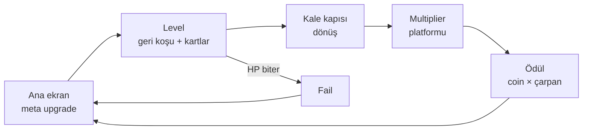
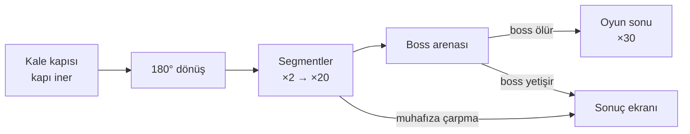

# Backwards Runner Okçu — GDD v0.1

Sep 24, 2026 · @Korhan

## Özet

Oyuncu geri geri koşan bir okçu. Kovalayan orduyu tek parmakla nişan alınan bombeli oklarla durdurur, level içinde kart seçerek build kurar ve bölüm sonunda o build'le multiplier platformunda en uzağa gitmeye çalışır.

| Konu | Karar |
| --- | --- |
| Tür | Hybrid-casual backwards runner + roguelite kart seçimi |
| Görünüm | 3D, portrait (9:16), ortaçağ teması |
| Platform | Tek HTML dosyası, mobil ve PC Chrome |
| Level süresi | 60–90 sn (FTUE levelları daha kısa) |
| Amaç | Test ve pitch prototipi |
| Uzun vadeli hedef | Multiplier platformunun sonundaki boss'u yenmek; bu prototipin sonu |

### Oyun döngüsü



Level'da kurulan build bonus aşamasına taşınır ve bir sonraki level'da sıfırlanır. Kalıcı ilerleme sadece ana ekrandaki meta upgrade'lerdedir.

### Tasarım sütunları

1. **Mesafe asıl kaynak.** Kovalayanlarla aradaki mesafe her kararın ölçüsüdür. Dondurmak, geri itmek ve hızlanmak hep mesafe kazandırır.
2. **Tek parmak, iki eksen.** Sürükleme şeridi, basılı tutma süresi derinliği belirler.
3. **Her kart birlikte çalışır.** Oyuncunun her oku sahip olduğu tüm etkileri taşır.
4. **Görünen güç.** Zırh parçaları, renkler ve sayılar düşmanın ne kadar güçlü olduğunu anlatır.
5. **Bir tık daha.** Bayrak, seni durduran muhafız ve uzaktaki boss oyuncuyu geri çağırır.

## Kontroller ve nişan sistemi

Tek girdi tap & hold: basılı tutarken nişan çizgisi uzar ve yatay sürükleme karakteri sağa sola taşır, bırakınca ok atılır. Hold yokken karakter yanal hareket etmez; referanstaki gibi hareket ve nişan aynı hareketin parçasıdır.

### Nişan

- **X ekseni:** Okun ineceği noktanın X'i karakterin o anki konumudur.
- **Derinlik:** İniş noktası hold süresiyle karakterden düşmanlara doğru uzar.
- **Uzama eğrisi:** Çizgi ease-out ile uzar: yakında hızlı, uzakta yavaş. Böylece hızlı germe de ince ayara izin verir.
- **Bombe:** Yol, iki nokta arasında alçak bir parabol çizer. Tepe yüksekliği mesafeyle artar (1 m + mesafenin %25'i).
- **Görsel:** Kesikli yay çizgisi + yerde isabet halkası. Halka, alan hasarı varsa o yarıçapı gösterir.
- **Max menzil:** Çizgi max menzile gelince orada durur ve hafifçe nabız atar. "Tam Gerilim" kartı bu anı ödüllendirir.
- **Min menzil:** 1.5 m. Kısa bir tap, karakterin dibindeki düşmanı vurabilir.
- **Mıknatıs:** Bırakma anında isabet halkasına 1.2 m'den yakın bir düşman varsa ok ona kilitlenir ve hareketini öngörerek iner.
- **Ok takma:** Her atıştan sonra 0.12 sn. Bu sürede yeni hold başlayabilir, çizgi süre bitince uzamaya başlar.

### Çoklu ok

Volley'deki oklar isabet noktasında yatayda yelpaze gibi açılır, oklar arası 0.8 m. Mıknatıs her ok için ayrı çalışır. Aynı düşmana birden fazla ok kilitlenebilir.

### Level-up kesintisi

1. Kartlar açılırken eldeki ok otomatik atılır.
2. Oyun 0.25 sn'de yavaşlayıp durur.
3. Kartlar açıldıktan sonra 0.3 sn input kilidi olur. Hâlâ basılı olan parmağın bırakılması yok sayılır.
4. Kart sadece yeni bir tap'le seçilir.
5. Oyun 0.3 sn'lik yavaş bir rampayla devam eder.

### Cihazlar

Dokunmatik ve fare tek bir Pointer Events katmanından gelir. Ekran genişliği kadar sürükleme, karakteri yolun bir ucundan diğerine taşır. PC'de sol tık basılı tutulup fare yatay hareket ettirilir.

## Oyuncu, HP ve kamera

Oyuncunun taban HP'si 100'dür ve HP bitince level fail olur. HP'yi üç şey azaltır: yetişen düşmanlar, düşman projectile'ları ve engeller.

| Değer | Başlangıç |
| --- | --- |
| Taban HP | 100 |
| Temel ok hasarı | 10 |
| Geri koşu hızı | 5.0 m/s |
| Yanal takip hızı (max) | 9 m/s |
| Yol genişliği / oyuncunun hareket alanı | 8 m / ±3.3 m |
| Min / max menzil | 1.5 m / 14 m |
| Germe süresi (min → max menzil) | 1.2 sn |
| İsabet yarıçapı | 0.6 m |
| Hasar sonrası dokunulmazlık | 0.6 sn (engel ve projectile için) |

### Hasar kaynakları

- **Yetişen düşman:** Önce en yakın ally'e takılır. Ally kalmayınca oyuncuya yapışır ve tipine göre saniye başı hasar verir. Yapışan düşman oyuncuyla aynı hızda koşar, kısa bir tap'le vurulabilir.
- **Projectile:** Tek darbe hasarı verir, dodge edilebilir.
- **Engel:** Tek darbe hasarı verir, ardından dokunulmazlık başlar.

### Ölüm

HP 0 olunca oyun yavaşlar, karakter devrilir ve fail ekranı açılır. Level'da kazanılan coin'in yarısı korunur, çarpan uygulanmaz. HP %30'un altına inince ekran kenarında kırmızı vignette ve kalp atışı sesi başlar.

### Kamera

Kamera koşu yönünün önünde durur ve geriye, kovalayanlara bakar. Karakter ekranın yukarıdan yaklaşık %42'sindedir. Üst kısım \~30 m derinliğe kadar kovalayanları, alt kısım ise yaklaşan engelleri gösterir. Kamera, oyuncunun X hareketini %40 oranında yumuşakça takip eder. Bonus aşamasında 0.8 sn'de 180° döner ve oyuncunun arkasına geçer.

## Ally sistemi

Ally'ler sadece kartlarla kazanılır ve oyuncunun nişanına tekli, elementsiz ok atar. Ok sayısı, element ve range kartları sadece oyuncuya işler; ally'ler ayrı kartlarla güçlenir. Bu yüzden "+3 asker" ile "+1 ok" gerçek bir tercihtir.

| Kural | Değer |
| --- | --- |
| Max ally | 20 |
| Ally ok hasarı | 5 (Sancaktar kartıyla artar) |
| Atış | Oyuncu bıraktığında, 0–0.12 sn gecikmeyle, isabet noktasının 1 m çevresine dağılır |
| Formasyon | Oyuncunun etrafında sıkı bir küme; ally sayısı arttıkça genişler, yay gibi gecikmeyle takip eder |
| Engel teması | Ally anında ölür |
| Düşman teması (level içi) | Düşman en yakın ally'e takılır, 0.6 sn sonra ally ölür, düşman bir sonrakine geçer |
| Projectile teması | Ally ölür |
| XP | Ally'lerin öldürdüğü düşmanın XP'si oyuncuya gelir |

Formasyon genişledikçe engellerden tam kurtulmak zorlaşır; kalabalık ordu güçlü ama kırılgan bir yatırımdır. Bonus aşamasında ally'ler otomatik ateş eder ama tampon değildir; kurallar Bonus aşaması bölümünde.

Ally görünümü: oyuncuyla aynı renkte kapüşonlu küçük okçular. Ally sayısı oyuncunun altında referanstaki gibi bir sayıyla görünür.

## Düşmanlar

Altı düşman tipi var. Her birinin gücü üzerindeki zırh tier'ından okunur: ne kadar çok zırh, o kadar çok HP. Level ilerledikçe daha yüksek tier'lar ve daha kalabalık dalgalar gelir.

| Tip | HP (T0) | Hız | L1'de yaklaşma | Temas hasarı | XP (T0) | Özellik | İlk level |
| --- | --- | --- | --- | --- | --- | --- | --- |
| Er | 20 | 6.4 m/s | 1.4 m/s | 8 /sn | 2 | Temel piyade | 1 |
| Koşucu | 10 | 7.4 m/s | 2.4 m/s | 5 /sn | 1 | Küçük, sürü halinde gelir | 2 |
| Kalkanlı | 60 | 6.0 m/s | 1.0 m/s | 10 /sn | 5 | Kalkan gölgesi: 1.5 m arkasına düşen oklar kalkana saplanır (%20 hasar) | 4 |
| Mızrakçı | 30 | 7.0 m/s | 12–16 m'de durur | 6 /sn | 4 | 3 sn'de bir oyuncunun X'ine mızrak atar | 5 |
| Davulcu | 40 | 6.8 m/s | 14–18 m'de durur | 4 /sn | 5 | 5 m çevresindeki düşmanlara +%35 hız | 7 |
| Dev | 400 | 5.7 m/s | 0.7 m/s | 25 /sn | 25 | Mini boss, level'ın \~%60'ında gelir, geri itmeye %50 dirençli | 6 |

Yaklaşma hızı = düşman hızı − oyuncunun geri koşu hızı (taban 5 m/s). Meta Hareket Hızı bu farkı doğrudan küçültür, düşman hızı ise level'la büyür.

### Arka saf hedefleri

Mızrakçı ve Davulcu arka safta durur ve uzağa nişan almanın sebebidir. Mızrak atışından 0.8 sn önce yerde kırmızı bir çizgi belirir. Mızrak 15 hasar verir, değdiği ally'i öldürür ve yana kaçarak dodge edilir. Kalkanlılar önde sıra oluşturur, arkalarındaki kalabalığa ancak daha uzağa atılan ok ulaşır.

### Zırh tier'ları

| Tier | Parçalar | HP çarpanı | Malzeme |
| --- | --- | --- | --- |
| T0 | Yok | ×1.0 | Kumaş, kırmızı |
| T1 | Kask | ×1.5 | Demir |
| T2 | Kask, göğüslük | ×2.2 | Demir |
| T3 | + Omuzluk | ×3.2 | Çelik |
| T4 | + Eldiven, dizlik | ×4.5 | Çelik, pelerin |
| T5 | + Yüz siperi | ×6.5 | Kara çelik, altın süs, kırmızı göz |

Dev'in HP'si tier çarpanı almaz, her zaman T5 görünür.

### Zırh düşmesi

Zırh sadece görseldir ve HP oranına bağlıdır. k parçalı bir düşmanda i. parça HP %(1 − i/(k+1)) seviyesine inince düşer. Örneğin 2 parçada %67 ve %33.

- **Sıra:** Dıştan içe: dizlik, eldiven, omuzluk, göğüslük, siper; kask en son düşer.
- **Fizik:** Parça yukarı ve geriye itilir, dönerek yolda sekerek 1.5 sn kalır, sonra kaybolur.
- **Ses:** Metal şıngırtısı.

### Geçici HP bar

Düşman ilk vuruşta başının üstünde HP bar gösterir. Son vuruştan 1.8 sn sonra bar 0.3 sn'de kaybolur. Dolgu kırmızıdır, kaybedilen kısım kısa bir süre sarı kalıp erir. Hasar sayıları kaynağın rengindedir: beyaz normal, sarı kritik, açık mavi buz, turuncu ateş, mor şimşek.

### Davranış

Düşmanlar \~30 m'de sisin içinden doğar. Kolon, sıra, kama ve küme dizilişlerinde gelirler. Oyuncunun X'ine 1.5 m/s yanal hızla yönelir, birbirlerine çarpmadan açılır ve taş duvarların etrafından dolanırlar. Ölünce geriye savrulup dönerek düşer; XP küresi XP barına uçar.

## Engeller

Beş engel tipi var. Hepsi oyuncuya hasar verir, ally'leri anında öldürür ve arkadan gelen düşmanlara da vurur. Oyuncu zamanla kovalayanları tuzaklara çekmeyi öğrenir.

| Engel | Davranış | Oyuncuya | Düşmana | İlk level |
| --- | --- | --- | --- | --- |
| Taş duvar | Sabit, yolun 1/3–1/2'sini kapatır | 20 hasar, yana itilir | 1 sn sersemler; diğerleri etrafından dolanır | 2 |
| Yerden diken | 2.5 m panel: 0.6 sn titreyerek uyarır, 0.8 sn yukarıda, 1.2 sn aşağıda | 15 hasar | Max HP'nin %35'i (Dev %10) | 3 |
| Sarkaç balta | Yolun üstünde 2.4 sn periyotla sallanır, gölgesi yere düşer | 20 hasar | Max HP'nin %50'si (Dev %15) | 5 |
| Dev Nöbetçi | Yol kenarında duran kocaman kılıçlı stickman. Kılıcı yolun %60'ını süpürür: 0.7 sn hazırlık, 0.3 sn savuruş, 1.2 sn toparlanma | 25 hasar | T0–T2 ölür ve fırlatılır; T3+ max HP'nin %50'si (Dev %20) | 6 |
| Yuvarlanan kütük | Ekranın altından dünyadan 4 m/s hızlı gelir, önce oyuncunun sonra düşmanların arasından geçer; yolun yarısı genişliğinde | 20 hasar | Ezer: max HP'nin %60'ı (Dev %20) | 8 |

### Okunabilirlik

- **Uyarı:** Engel ekrana girmeden 1.5 sn önce alt kenarda, engelin X'inde kırmızı bir ünlem belirir. Kütükte bu süre 2 sn'dir.
- **Tehlike alanı:** Diken, balta ve Nöbetçi'nin vuruş alanı vuruştan önce yerde kırmızı bir işaretle gösterilir.
- **Darbe:** Oyuncu vurulunca kamera hafif sarsılır, ekran kırmızı flash yapar ve karakter sendeler.

### Yerleştirme kuralları

- 4 sn'de en fazla bir engel olayı olur, FTUE'de 6 sn.
- Her an en az 2.5 m genişliğinde güvenli bir yol vardır. Büyük formasyon bu yola sığmayabilir; ally kaybı tasarımın parçasıdır.
- Ters yönde kaçış isteyen iki engel arasında en az 1.2 sn vardır.
- Düşmanlar taş duvarın etrafından dolanır ama diken, balta, Nöbetçi ve kütüğü fark etmez.

## XP, level-up ve kart sistemi

Hedef: level başına 5–7 kart seçimi, ilk kart 8–10. saniyede. Kartlar her level başında sıfırlanır.

### XP

Ölen düşmanın XP'si otomatik olarak XP barına uçar, toplama yoktur. n. level-up için gereken XP = 6 + 6n: 12, 18, 24, 30, 36, 42, 48… Birikmiş XP bir sonraki eşiği de geçerse kartlar arka arkaya gelir.

### Nadirlik

| Nadirlik | İhtimal | Çerçeve |
| --- | --- | --- |
| Sıradan | %60 | Gri |
| Nadir | %30 | Mavi |
| Epik | %10 (3. level-up'tan itibaren) | Mor, parlayan |

Aynı kart farklı nadirliklerde daha güçlü gelebilir, örneğin Asker Çağır: sıradan +1, nadir +2, epik +3.

### Teklif kuralları

- Her teklif 3 farklı kart içerir. Max alıma ulaşmış kart gelmez.
- Level'ın ilk teklifi her zaman bir element kartı ve bir Asker Çağır ya da Çoklu Ok içerir.
- Bir element seçilince diğer ikisi o level boyunca gelmez, seçilen elementin kartları havuza girer.
- Sahip olunan kartların ağırlığı %50 artar; build tutarlı kalır.
- Şartlı kartlar ancak şartı sağlanınca gelir, örneğin İyileşme İksiri sadece HP %70'in altındayken.

### Kart ekranı

Portrait ekranda kartlar alt alta üç geniş satır olarak gelir. Her kartta nadirlik çerçevesi, ikon, isim, tek satırlık açıklama ve seviye göstergesi (örn. 2/4) bulunur. İlk kez gelen kartta "Yeni" etiketi olur. Seçilen kart büyüyüp oyuncuya uçar, oyuncunun etrafında altın bir halka patlar.

## Kart listesi

35 kart ve bir set bonusu, beş kategori. Açıklamalar oyundaki kart metnidir. Nadirlik sütununda birden fazla değer varsa etki sütunu aynı sırayla o nadirliğin değerini verir.

### Ok kartları

| Kart | Nadirlik | Kart metni | Max alım |
| --- | --- | --- | --- |
| Keskin Uç | S / N / E | Ok hasarı +%15 / +%25 / +%40 | 6 |
| Çoklu Ok | N / E | +1 ok / +2 ok | Toplam 7 ok |
| Uzun Menzil | S / N | Max menzil +%15 / +%25 | 4 |
| Patlayan Uç | N | Oklar 1.2 m alanda %50 hasar verir. Sonraki alımlar: +0.4 m, +%10 | 4 |
| Kafa Vuruşu | S / N | Kritik şansı +%10 / +%15. Kritik ×2 hasar | %50 şans |
| Tam Gerilim | N | Max menzilde bırakılan ok +%60 hasar. Sonrakiler +%40 | 3 |
| Sekme | N | Ok indikten sonra en yakın düşmana seker (%60 hasar). Sonrakiler +1 sekme | 3 |
| Ok Yağmuru | E | Her 6. atışta hedefe 12 ok yağar. Sonrakiler: 1 atış erken, +4 ok | 3 |
| Geri İtme | S | Vurulan düşman 1.5 m geri savrulur. Sonrakiler +1 m | 3 |
| İnfaz | N | HP'si %12'nin altına düşen düşman ölür. Sonrakiler +%4. Dev'de yarısı | 3 |

### Element kartları

Run başına tek element seçilir. Element kartı alınınca o elementin kartları havuza girer.

| Kart | Nadirlik | Kart metni | Max alım |
| --- | --- | --- | --- |
| Buz Oku | N | Oklar 0.8 sn dondurur ve %30 ek buz hasarı verir | 1 |
| Derin Don | S | Donma süresi +0.4 sn | 4 |
| Buz Kırığı | N | Donmuş düşman ölünce yakınındakileri 0.5 sn dondurur | 1 |
| Ateş Oku | N | Oklar 2 sn yakar: saniyede ok hasarının %30'u | 1 |
| Uzun Yanma | S | Yanma süresi +1 sn | 4 |
| Yayılan Alev | N | Yanan düşman ölünce ateş yakınındakilere sıçrar | 1 |
| Şimşek Oku | N | Oklar 2 düşmana zincirlenir (%70 hasar) | 1 |
| Zincir | S | +1 zincir | 5 |
| Yıldırım Çarpması | N | Zincirdeki düşmanlar 0.3 sn sersemler | 1 |
| Element Gücü | S / N | Element hasarı +%25 / +%40 | 4 |

Zincir, vurulan düşmandan 4 m içindeki en yakın ve henüz vurulmamış düşmana sıçrar. Element Gücü buz ek hasarını, yanmayı ve zincir hasarını artırır.

### Ally kartları

| Kart | Nadirlik | Kart metni | Max alım |
| --- | --- | --- | --- |
| Asker Çağır | S / N / E | +1 / +2 / +3 asker | 20 asker |
| Kalkanlı Asker | N | Engele ilk o çarpar, darbeyi emip düşer | 3 |
| Sıkı Düzen | S | Formasyon %25 daralır | 2 |
| Sancaktar | S | Ally ok hasarı +%30 | 5 |
| Element Paylaşımı | E | Ally okları senin elementini taşır. Element ve en az 3 asker gerekir | 1 |

### Zırh kartları

Parçalar oyuncunun üstünde görünür. Düşmanlar zırh dökerken oyuncu zırhlanır.

| Kart | Nadirlik | Kart metni | Max alım |
| --- | --- | --- | --- |
| Kask | N | +25 max HP, 25 HP iyileşir | 1 |
| Göğüslük | N | Düşman hasarı −%20 | 1 |
| Eldiven | N | Yay germe %15 hızlanır | 1 |
| Tozluk | N | Engel hasarı −%40 | 1 |
| Çizme | N | Geri koşu hızı +%6 | 1 |
| Tam Zırh | Otomatik | 5 parça tamamlanınca: tüm hasar −%20, karakter altın parlar | — |

### Genel kartlar

| Kart | Nadirlik | Kart metni | Max alım |
| --- | --- | --- | --- |
| Kalkan | N | Engel ya da mızrak darbesini bir kez emer, tüm birliği korur. 8 sn'de yenilenir. Sonrakiler −2 sn | 3 |
| Çivi Tuzağı | S / N | 4 sn'de bir düşmanların yoluna çivi saçar: ok hasarının 1.5 katı ve %40 yavaşlama. Sonrakiler +%50 hasar, −0.5 sn | 4 |
| Can Emme | S | Her öldürmede 1 HP. Sonrakiler +1 | 4 |
| Bilgelik | S | +%20 XP | 3 |
| İyileşme İksiri | S | Anında %30 HP. HP %70'in altındayken gelir | Sınırsız |

### Birlikte çalışma kuralları

- **Her ok her şeyi taşır:** Oyuncunun volley'indeki her ok tüm ok ve element etkilerini taşır. Kritik her ok için ayrı zar atar.
- **Sekme ve Ok Yağmuru:** Sekme okları element ve kritik taşır. Ok Yağmuru okları element taşır ama sekmez ve yeni bir Ok Yağmuru tetiklemez.
- **Durum etkileri:** Donma ve yanma üst üste binmez, süreyi yeniler.
- **Zincir sınırı:** Bir volley'de her düşmana en fazla bir zincir değer. Volley başına en fazla 30 sıçrama olur (performans).
- **Geri itme sınırı:** Aynı düşmana 0.3 sn'de bir uygulanır.
- **Yüzdeler toplanır:** Aynı stat'ın yüzdeleri çarpılmaz, toplanır. Örneğin +%15 ve +%25 Keskin Uç, +%40 eder.
- **Germe sınırı:** Germe süresi Eldiven dahil en az 0.6 sn'dir.
- **Bonus aşaması:** Tüm kartlar aynen çalışır. Tam Gerilim, max menzilin %90'ından uzaktaki hedefe yapılan otomatik atışlara uygulanır.

## Bonus aşaması: multiplier köprüsü ve boss

Level sonunda oyuncu kale kapısından geçer ve kapı kovalayanların önüne iner. Karakter döner, level'da kurduğu build'le multiplier köprüsünde otomatik ateş ederek ileri koşar. Platform her level'da zorlaşır, sonunda her zaman boss vardır.



### Kurallar

| Konu | Karar |
| --- | --- |
| İleri koşu hızı | 4.5 m/s, sabit; meta Hareket Hızı etkilemez |
| Kontrol | Basılı tutup sürüklemek sadece yanal hareket; nişan yok |
| Ateş | Oyuncu ve ally'ler otomatik ateş eder |
| Hedef | Menzildeki, oyuncunun X'ine en yakın muhafız. Sağa sola hareket hedef seçmektir |
| Atış hızı | 1 / (germe süresi × 0.6): tabanda 1.4, sınırda 2.8 atış/sn |
| Menzil | Oyuncunun max menzili; Uzun Menzil kartı burada da işler |
| Engel ve projectile | Yok, sadece muhafızlar |
| Segment | 12 m, 19 segment (×2 → ×20), sonunda boss arenası |
| Ödül | Level coin'i × tamamen geçilen son segmentin çarpanı. Boss ölürse ×30 |

### Çarpışma

Oyuncu yaşayan bir muhafıza çarparsa run biter ve tüm birlik devrilir. Ally'ler tampon değildir: kenarda bir muhafıza sürtünen ally ölür, muhafız yerinde kalır.

### Segment muhafızları

Her segmentte yolu kaplayan 3–5 muhafızlık bir sıra durur. Sıranın bir noktası zayıftır: o muhafız bir tier düşüktür ve HP'si sıranın %60'ıdır. Muhafızlar oyuncu 8 m'ye gelince silahını kaldırır.

```latex
HP_{muhafız}(s, L) = 30 \times 1.28^{\,s-1} \times 1.03^{\,L-1}
```

s segment sırası (1–19), L level numarasıdır. Hedef: yeni oyuncu ×4–×6'ya, ortalama oyuncu ×8–×12'ye ulaşır; güçlü bir build ilk kez 18–22. level civarında boss'a varabilir.

### Tehdit artışı

- **Tier ve boy:** Tier segmentle yükselir, boy her segmentte %3 büyür.
- **×10 sonrası:** Kırmızı parlayan gözler ve sancaklar.
- **×15 sonrası:** Kara çelik zırh, omuzlarda alev.
- **Segment kemerleri:** Her segmentin başında büyük "×N" kemeri durur. Renk yeşilden sarı, turuncu, kırmızı ve mora geçer.
- **İsimler:** Demir Muhafız (T1–T2), Çelik Muhafız (T3–T4), Kara Şövalye (T5).

### Bayrak ve "seni durduran"

Köprüde tüm zamanların en iyi çarpanında bir "EN İYİ ×N" bayrağı dalgalanır. Bir önceki level'da ulaşılan nokta yarı saydam bir bayrakla gösterilir. Sonuç ekranında ve bir sonraki level'ın başında oyuncuyu durduran muhafız adı, tier'ı ve HP'siyle gösterilir.

### Boss: Kara Lord

- **Görünüm:** 8 m boyunda, 12 zırh parçalı dev şövalye. Parçalar HP oranına göre dökülür, HP barı ekranın üstünde isimle durur.
- **Arena:** Oyuncu arenaya girince ileri koşu durur. Boss 16 m'den 1 m/s ile yaklaşır; yetişirse run ×20 ile biter.
- **HP:** Son segmentin zayıf muhafızının 6 katı. Oraya kadar gelen build'in boss'u zorlanarak yenmesi hedeflenir.
- **Saldırı:** 3.5 sn'de bir kılıç darbesi. Oyuncunun X'inde, yolun %40'ı genişliğinde kırmızı alan 1 sn önce belirir. Alandaki ally'ler ölür, oyuncu alandaysa run biter.
- **Öfke:** HP %50'nin altına inince darbe aralığı 2.5 sn'ye düşer.
- **Zafer:** Slow-mo, zırh parçaları dört bir yana saçılır, ×30 ödül ve prototipin oyun sonu ekranı.

## Meta ilerleme ve ekonomi

Ana ekranda üç kalıcı upgrade var ve tek para birimi coin. Her upgrade küçük adımlarla ilerler: HP hemen hissedilir, diğer ikisi yaklaşık 10–15 seviyede fark edilir hale gelir.

| Upgrade | Seviye başına | Taban | Sınır | Görsel geri bildirim |
| --- | --- | --- | --- | --- |
| Can | +5 max HP | 100 | Yok | Butonda "100 → 105"; her 5 seviyede kalp rozeti büyür |
| Hareket Hızı | Geri koşu +%0.6 (sadece level içi) | 5.0 m/s | 30 seviye (+%18) | Her 5 seviyede pelerin uzar ve renk değiştirir |
| Saldırı Hızı | Germe süresi −0.0144 sn (tabanın %1.2'si) | 1.2 sn | 28 seviye (0.8 sn) | Her 5 seviyede yay malzemesi değişir: tahta, demir, çelik, altın, runik |

Saldırı Hızı bonus aşamasındaki otomatik atış hızını da belirler. Eldiven kartı germe süresini meta sınırının altına, en fazla 0.6 sn'ye indirebilir.

### Maliyet ve gelir

```latex
Maliyet(n) = 40 \times 1.2^{\,n}
```

```latex
Gelir(L) = (öldürme sayısı + 10 + 2L) \times ulaşılan \ çarpan
```

n upgrade'in mevcut seviyesi, L level numarasıdır. Her öldürme 1 coin verir. Hedef tempo: ilk levelda 4–5 upgrade, 10. level civarında level başına 3–4 upgrade. Bu tempoyla Saldırı Hızı sınırına \~40. levelda ulaşılır. Fail olunca level coin'inin yarısı korunur ve çarpan uygulanmaz.

### Yönlendirme

- **Butonlar:** Mevcut ve bir sonraki değeri, maliyeti gösterir. Alınabilen upgrade hafifçe nabız atar, alınamayan gri kalır.
- **Fail ekranı:** Ölüm sebebine göre öneri yapar. Düşmanlar yetiştiyse Hareket Hızı ya da Saldırı Hızı, engeller ve mızraklar öldürdüyse Can önerilir.
- **Önerilen etiketi:** Ana ekranda önerilen upgrade'in üstünde "Önerilen" etiketi durur.

## Level yapısı, FTUE ve zorluk

Normal bir level yaklaşık 75 sn sürer ve dört fazdan oluşur. İlk 8 level FTUE'dir ve her biri bir yeni düşman ya da engel tanıtır.

| Faz | Süre | İçerik |
| --- | --- | --- |
| Isınma | 0–10 sn | Küçük Er ve Koşucu grupları; ilk kart 8–10. sn'de |
| Yükseliş | 10–40 sn | Dalgalar büyür, engeller ve arka saf düşmanları girer |
| Zirve | 40–60 sn | Yoğun dalgalar; Dev yaklaşık 45. sn'de |
| Final | 60–75 sn | Son dalga, kale kapısı görünür ve kovalayanların önüne iner |

Dalgalar 6–9 sn'de bir gelir, aralarda tek tek düşman akışı sürer. Level'lar level numarasından üretilen seed ile, hazır dalga ve engel şablonlarından prosedürel kurulur. Aynı level her denemede aynı düzende gelir; takılan oyuncu aynı duvarı tekrar dener.

### FTUE

| Level | Süre | Öğretilen | Yeni içerik |
| --- | --- | --- | --- |
| 1 | \~40 sn | "Basılı tut, nişan al" ve "Bırak, ateş et". İlk kart 3. öldürmede, teklif sabit: Çoklu Ok, Asker Çağır, Keskin Uç | Er T0. Kısa bonus köprüsü (×2–×5) otomatik ateşi ve yanal hareketi öğretir |
| 2 | \~50 sn | "Sürükle ve kaç". İlk teklifte element garanti | Koşucu, taş duvar |
| 3 | \~60 sn | Zırh düşmesi | Kasklı Er (T1), diken, tam köprü ve boss |
| 4 | 60–75 sn | Kalkan gölgesi, uzağa nişan alma | Kalkanlı |
| 5 | 60–75 sn | Mızrak dodge | Mızrakçı, sarkaç balta |
| 6 | 60–75 sn | Mini boss | Dev, Dev Nöbetçi |
| 7 | 60–75 sn | Arka saf önceliği | Davulcu |
| 8 | 60–75 sn | Düşmanı tuzağa çekme | Yuvarlanan kütük |

Level 9'dan itibaren tüm düşman ve engeller karışık gelir, tier'lar Denge bölümündeki kurala göre yükselir.

### Zorluk eğrisi

Upgrade almayan oyuncu \~8. level'da baskının altına düşer ve 10–12. level'da takılır. Düzenli upgrade alan oyuncu önde kalır ama fark yavaşça daralır; geç levellarda build ve beceri daha çok önem kazanır.

&#91;embedded content: Hedef model · baskı 1.06^(L−1), upgrade almadan 1.3×1.02^(L−1), düzenli upgrade ile 1.3×1.058^(L−1)\]

Eğriler hedeftir, simülasyon sonucu değildir. Prototipte debug paneliyle ölçülüp Denge bölümündeki katsayılarla ayarlanacak.

## UI/UX ve ekranlar

Yedi ekran var, hepsi portrait ve tek elle kullanılır. Sayılar referanstaki gibi kalın, konturlu bir display font'la yazılır; font dosyaya gömülür.

| Ekran | İçerik |
| --- | --- |
| Ana ekran | Logo, köprüde bekleyen karakter, level numarası, coin, en iyi çarpan. Altta üç upgrade butonu: ikon, seviye, mevcut → sonraki değer, maliyet. Nabız atan "Başlamak için dokun" yazısı |
| Level HUD | Üstte kale kapısına kalan mesafe ve level numarası, altında XP barı ve run seviyesi. Sağ üstte coin. Oyuncunun başının üstünde küçük HP barı, altında ally sayısı. Alt kenarda engel uyarıları |
| Kart seçimi | Ekran kararan bir perdeyle örtülür, üç kart alt alta gelir |
| Bonus HUD | Segment kemerleri, "Ödül: 57 × 7" canlı önizlemesi, en iyi bayrağı |
| Sonuç | Ulaşılan çarpan büyük yazılır, coin sayacı yukarı sayar. "Seni durduran: Çelik Muhafız · HP 1.240" kartı ve Devam butonu |
| Fail | "Düştün", level'ın yüzde kaçının tamamlandığı, ölüm sebebine göre upgrade önerisi. Tekrar dene ve Ana ekran butonları |
| Oyun sonu | "Kara Lord yenildi", toplam süre ve level sayısı, kazanan build'in kart ikonları, "Prototipin sonu" |

### Okunabilirlik kuralları

- **Font boyutu:** 390 px genişlikte en az 16 px, kart açıklamaları dahil.
- **Dokunma alanı:** Butonlar en az 56 px yüksekliğinde.
- **Kart metni:** Tek satır. Sığmayan metin kısaltılır, font küçültülmez.
- **Renk kodları:** Oyuncu takımı yeşil ve altın, düşman kırmızı ve kara çelik, tehlike kırmızı yarı saydam alan.

### Ses

Sesler WebAudio ile prosedürel üretilir, dosyaya ses eklenmez. Temel efektler: yay germe (hold süresince yükselen ton), ok bırakma, isabet, kritik, zırh şıngırtısı, donma, yanma, şimşek, level-up, coin, engel darbesi ve boss kükremesi. Ses ilk dokunuşta başlar; ana ekranda ses açma/kapama butonu vardır.

## Art direction

Referansın temiz, dokusuz ve parlak stili ortaçağa taşınır: flat-shaded low-poly, doygun karakter renkleri, açık ve okunaklı bir yol. Polish'i doku yerine ışık, gölge, metal yansımaları ve juice taşır. Tüm geometri kodla üretilir, harici asset yoktur.

### Dünya

Yol, turkuaz bir denizin üstünde uzanan uzun bir sur yolu ya da taş köprüdür. Referanstaki sarı rayların yerini hardal renkli mazgallı korkuluklar alır. Çevrede adalarda low-poly kaleler, kuleler, yel değirmenleri, çam kümeleri ve sancaklar durur. Köprünün altından süzülen bulutlar yükseklik hissi verir.

Bonus köprüsü daha koyu taştandır: kırmızı halı, kemerler, meşaleler. Boss arenası yuvarlak bir platformdur, arkasında dev bir taht kapısı vardır. Arenaya yaklaşırken ışık gün batımı tonlarına döner.

### Renk paleti

| Rol | Hex |
| --- | --- |
| Gökyüzü, üstten ufka | #7FD6F2 → #E6F7FF |
| Deniz | #3CC7CF |
| Yol taşı / chevron | #F5F0E6 / #D6E4F2 |
| Mazgallı korkuluk | #E4AE45 |
| Uzak kaleler: duvar / kiremit / arduvaz | #E8E2D6 / #C8614A / #6F7D8C |
| Oyuncu | #F2A33A (turuncu-altın, küçük taç) |
| Ally | #4CD964 |
| Düşman kumaşı | #E0413A |
| Demir / çelik / kara çelik / altın süs | #9AA3AD / #C9D1D9 / #3A3F47 / #D9A93F |
| Buz / ateş / şimşek | #7FE3FF / #FF7A2E / #A58BFF |
| Kritik | #FFD84A |
| Tehlike alanı | #FF3B3B, %40 opaklık |

### Karakterler

Stickman oranları korunur: iri yuvarlak kafa, kapsül uzuvlar, yüz yok. Sadece T5 düşmanlarda ve boss'ta parlayan kırmızı gözler olur. Oyuncu kapüşonlu, küçük taçlı ve yaylıdır; ally'ler yeşil kapüşonlu küçük okçulardır. Düşmanlar kırmızı tunik giyer, zırh parçaları basit primitiflerden kurulur: yarım küre kask, yuvarlatılmış kutu göğüslük, çeyrek küre omuzluk. Animasyonlar prosedüreldir: koşu salınımları, yay germe, sendeleme, ölüm savrulması.

### Işık

- **Işıklar:** Hemisphere light (gök #CFEFFF, zemin #F2E6D0) ve sıcak bir directional güneş (#FFF1DC).
- **Gölge:** Oyuncuyu takip eden yumuşak shadow map. Uzaktaki ve küçük birimlerde ucuz blob gölge.
- **Metal:** Zırhlar metalik malzeme kullanır ve prosedürel bir gökyüzü environment map'ini yansıtır. Zırhın parlaması gücün görsel sinyalidir.
- **Rim light:** Karakterlerin kenarlarında ince bir parlaklık, beyaz yolun üzerinde silueti ayırır.
- **Sis:** 35–75 m arası gökyüzü rengine sis. Kovalayanlar pusun içinden çıkar.
- **Renk:** ACES tone mapping ve sRGB çıkış.

### Juice

- **İsabet:** 60 ms beyaz flash, squash & stretch, hasar sayısı pop'u, toz bulutu.
- **Oklar:** Element renginde iz. Kritikte sarı kıvılcım ve hafif kamera sarsıntısı.
- **Elementler:** Donmada buz kristali kabuğu, yanmada alev partikülleri, şimşekte titreyen kırık çizgiler.
- **Ölüm:** Geriye savrulma ve dönme, zırh parçalarının saçılması, XP küresinin bara uçması.
- **Level-up:** Slow-mo ve oyuncunun etrafında altın halka patlaması.
- **Bonus ve boss:** Kemerden geçerken çarpan sayısı büyüyüp söner. Boss ölümünde uzun slow-mo.

## Teknik

Oyun tek bir index.html dosyasıdır ve internet bağlantısı olmadan açılır. Three.js, font ve tüm kod dosyanın içine gömülüdür, sesler kodla üretilir. Tahmini boyut 1–1.5 MB.

### Performans bütçesi

Hedef: orta segment Android'de Chrome ile ve iPhone 11 ve üstünde 60 fps.

| Kalem | Sınır |
| --- | --- |
| Ekrandaki düşman | 80 |
| Ally | 20 |
| Aktif ok | 150 |
| Partikül | 800 |
| Draw call | 120'nin altı |
| Gerçek gölge düşüren | Oyuncu, ally'ler, Dev, boss, engeller |

### Mimari

- **Instancing:** Her takımın vücut parçaları ve her zırh parçası tipi tek bir InstancedMesh'tir. HP barları ve hasar sayıları da instanced billboard'lardır.
- **Pooling:** Oklar, partiküller, hasar sayıları ve düşen zırh parçaları havuzdan gelir, oyun sırasında yeni obje oluşturulmaz.
- **Simülasyon:** Sabit adımlı (60 Hz) oyun mantığı, render'dan ayrı. XZ düzleminde çember çarpışma, oklar için analitik parabol, zırh parçaları için basit yerçekimi ve sekme. Zincir, mıknatıs ve alan hasarı için uzamsal grid.
- **UI:** Menüler, kartlar ve HUD metni canvas'ın üstünde DOM katmanıdır; metin her ekranda keskin kalır.
- **Ayarlar:** Tüm denge değerleri dosyanın başındaki tek bir CONFIG objesindedir.

### Cihaz ve ekran

- **Input:** Dokunma ve fare Pointer Events ile tek yoldan gelir. Kaydırma, çift dokunma zoom'u ve sağ tık menüsü kapatılır. Sekme arka plana geçince oyun durur.
- **Ekran:** Oyun alanı 9:16'dır. PC'de ortalanır, kenarlar sahnenin renginde kalır. Mobil yatay tutulursa "Cihazı dikey tut" uyarısı çıkar. Çentikli ekranlarda safe area korunur.
- **Kayıt:** Coin, upgrade seviyeleri, level, en iyi çarpan ve son durduran muhafız localStorage'da tutulur. Kayıt kullanılamıyorsa oyun oturum boyunca çalışmaya devam eder.
- **Otomatik kalite:** FPS düşerse sırayla pixel ratio (2 → 1.5 → 1.25), gölge çözünürlüğü ve partikül sayısı düşürülür.

### Debug paneli

Adrese ?debug=1 eklenince açılır: FPS, level seçimi, coin ekleme, kart verme, ölümsüzlük, zaman ölçeği ve seed. Pitch ve denge testleri için kullanılır, normal oyunda görünmez.

## Denge ve ölçekleme

Level, düşmanların HP'sini doğrudan çarpmaz. Bir düşmanın HP'si sadece tipinden ve tier'ından gelir; level ise tier karışımını, düşman sayısını ve hızı belirler. Oyuncu ekranda ne görüyorsa o kadar güçlü bir düşmanla karşılaşır.

| Kural | Formül ya da değer | Not |
| --- | --- | --- |
| Düşman HP | Tip taban HP'si × tier çarpanı | Tablolar Düşmanlar bölümünde |
| Level HP bütçesi | 900 × 1.06^(L−1) | Level'daki tüm düşmanların toplam HP'si. FTUE'de %60–80 |
| En yüksek tier | min(5, 1 + L/4 aşağı yuvarlanır) | FTUE'de tabloya göre |
| Ortalama tier | En yüksek tier − 1 civarı | Kalkanlı +1 tier ile doğar |
| Düşman hızı | Taban × (1 + 0.008 × (L−1)), en fazla +%30 | Meta Hareket Hızı bununla yarışır |
| Engel olayı sayısı | min(14, 4 + 0.5 × L) | FTUE hariç |
| Engel hasarı | Taban × (1 + 0.03 × (L−1)) |  |
| Düşman XP'si | Tip XP'si × (1 + 0.5 × tier) | Yüksek levellarda daha çok kart gelir |

### Ayar düğmeleri

Prototipte ilk çevrilecek değerler bunlar. Hepsi CONFIG'de ve debug panelinden canlı değiştirilebilir olmalı.

| Parametre | Başlangıç | Etkilediği |
| --- | --- | --- |
| Bütçe büyümesi | %6 / level | Upgrade almayan oyuncunun takıldığı level |
| Düşman hız büyümesi | %0.8 / level | Hareket Hızı upgrade'inin değeri |
| Germe süresi | 1.2 sn | Temel DPS ve kontrol hissi |
| Yaklaşma hızı (Er, L1) | 1.4 m/s | Baskı hissi |
| Donma süresi | 0.8 sn | Buz build'inin gücü; donan düşman saniyede 5 m geri düşer |
| Muhafız HP büyümesi | Segment başı %28, level başı %3 | Boss'a ulaşılan level |
| Maliyet büyümesi | %20 / upgrade seviyesi | Meta ilerleme temposu |

## Kapsam ve açık konular

Prototip bu dokümandaki her şeyi kapsar: FTUE dahil tüm levellar, 35 kart, 6 düşman, 5 engel, multiplier köprüsü, boss, meta upgrade'ler ve debug paneli.

### Sonraki sürüme kalanlar

- **Evrim kartları:** Element kombinasyonları, örneğin buz ve 5'li ok birleşince Tipi.
- **Element ve zırh etkileşimi:** Ateşin zırhı eritmesi, şimşeğin metale bonus vurması.
- **Monetizasyon:** Kart yenileme, revive ve çift ödül için rewarded reklam.
- **Boss sonrası:** Yeni dünyalar, güçlenen boss, skin'ler ve ikinci para birimi.
- **Müzik:** Prototipte sadece efekt sesleri var.

### Açık sorular

- [ ] UI dili: pitch için İngilizce mi, Türkçe mi? Bu dokümandaki kart metinleri Türkçe.
- [ ] Oyunun çalışma adı.
- [ ] Fail olunca level coin'inin yarısını koruma kuralı uygun mu?
- [ ] Boss'a ilk ulaşma hedefi 18–22. level mi, yoksa pitch için daha erken mi (örn. 10–12)?
