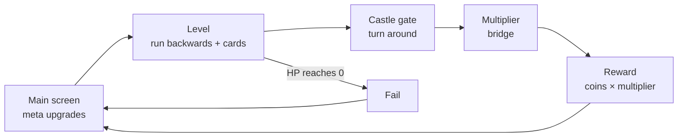
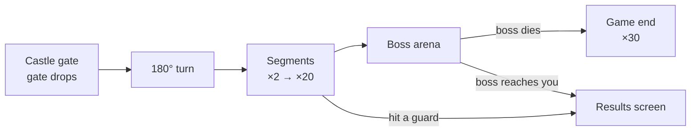

# Backwards Runner Archer — Game Design Document v0.1

Date: 2026-09-24 · Purpose: test / pitch prototype

> **Note for implementation:** every number in this document is a starting value. All of them live in a single `CONFIG` object and should be tweakable from the debug panel.

---

## 1. Overview

The player is an archer running backwards. They hold off a chasing army with lobbed arrows aimed with one finger, build a run by picking cards during the level, and at the end of the level test that build on a multiplier bridge, trying to get as far as possible.

| Topic | Decision |
| --- | --- |
| Genre | Hybrid-casual backwards runner + roguelite card picks |
| View | 3D, portrait (9:16), medieval theme |
| Platform | Single HTML file, mobile and desktop Chrome |
| UI language | English |
| Level length | 60–90 s (FTUE levels are shorter) |
| Long-term goal | Defeat the boss at the end of the multiplier bridge; this is the end of the prototype |

### Core loop



The build made during a level carries into the bonus stage and resets at the start of the next level. Permanent progression exists only in the meta upgrades on the main screen.

### Design pillars

1. **Distance is the core resource.** The gap to the chasers is the measure of every decision. Freezing, knocking back and running faster all buy distance.
2. **One finger, two axes.** Dragging sets the lane, hold duration sets the depth.
3. **Every card works together.** Every player arrow carries every effect the player owns.
4. **Visible power.** Armor pieces, colors and numbers tell the player how strong an enemy is.
5. **One more try.** The best-run flag, the guard that stopped you and the distant boss pull the player back.

---

## 2. Controls & Aiming

The only input is tap & hold. While holding, the aim line grows and horizontal dragging moves the character left and right; releasing fires. Without a hold the character does not move sideways — movement and aiming are the same gesture, as in the reference.

### Aiming

- **X axis:** The landing point's X is the character's current X.
- **Depth:** The landing point extends from the character toward the enemies as the hold continues.
- **Growth curve:** The line grows with ease-out: fast near, slow far. Fast draw speeds still allow fine adjustment.
- **Arc:** The path is a low parabola between the two points. Apex height grows with distance (1 m + 25% of distance).
- **Visuals:** Dashed arc line + a ring on the ground at the landing point. If the player has area damage, the ring shows that radius.
- **Max range:** When the line reaches max range it stops there and pulses gently. The Full Draw card rewards this moment.
- **Min range:** 1.5 m. A quick tap can hit an enemy right at the character's feet.
- **Aim assist:** On release, if an enemy is within 1.2 m of the landing ring, the arrow locks onto it and lands where it will be.
- **Nock time:** 0.12 s after each shot. A new hold can start during it; the line starts growing when it ends.

### Multishot

Arrows in a volley fan out horizontally at the landing point, 0.8 m apart. Aim assist runs per arrow. Several arrows may lock onto the same enemy.

### Level-up interruption

1. When the cards open, the arrow being drawn is fired automatically.
2. The game slows down over 0.25 s and pauses.
3. After the cards appear there is a 0.3 s input lock. Releasing a finger that is still held down is ignored.
4. A card is only selected with a fresh tap.
5. The game resumes with a 0.3 s slow-motion ramp.

### Devices

Touch and mouse come through a single Pointer Events layer. A drag the width of the screen moves the character from one edge of the road to the other. On desktop: hold left mouse button and move horizontally.

---

## 3. Player, HP & Camera

Base HP is 100; when HP reaches 0 the level fails. Three things reduce HP: enemies that catch up, enemy projectiles and obstacles.

| Value | Start |
| --- | --- |
| Base HP | 100 |
| Base arrow damage | 10 |
| Backward run speed | 5.0 m/s |
| Max lateral follow speed | 9 m/s |
| Road width / player movement range | 8 m / ±3.3 m |
| Min / max range | 1.5 m / 14 m |
| Draw time (min → max range) | 1.2 s |
| Hit radius | 0.6 m |
| Invulnerability after a hit | 0.6 s (obstacles and projectiles) |

### Damage sources

- **Enemy that catches up:** First latches onto the nearest ally. With no allies left, it latches onto the player and deals damage per second based on its type. A latched enemy runs at the player's speed and can be hit with a short tap.
- **Projectile:** Single-hit damage, can be dodged.
- **Obstacle:** Single-hit damage, followed by invulnerability.

### Death

At 0 HP the game slows, the character falls and the fail screen opens. Half of the coins earned in the level are kept; no multiplier is applied. Below 30% HP a red vignette appears at the screen edges with a heartbeat sound.

### Camera

The camera sits ahead of the character in the running direction and looks back at the chasers. The character sits at about 42% of the screen height, measured from the top. The upper part shows chasers up to ~30 m deep; the lower part shows incoming obstacles. The camera follows the player's X softly at 40%. In the bonus stage it rotates 180° over 0.8 s and moves behind the player.

---

## 4. Allies

Allies are gained only through cards and fire single, non-elemental arrows at the player's aim point. Arrow count, element and range cards apply only to the player; allies get stronger through their own cards. This makes "+3 soldiers" vs "+1 arrow" a real choice.

| Rule | Value |
| --- | --- |
| Max allies | 20 |
| Ally arrow damage | 5 (increased by Standard Bearer) |
| Firing | When the player releases, with 0–0.12 s stagger, scattered within 1 m of the landing point |
| Formation | Tight cluster around the player; widens as the count grows; follows with a springy lag |
| Obstacle contact | Ally dies instantly |
| Enemy contact (in level) | Enemy latches onto the nearest ally, the ally dies after 0.6 s, the enemy moves on to the next |
| Projectile contact | Ally dies |
| XP | XP from enemies killed by allies goes to the player |

As the formation widens, fully dodging obstacles gets harder; a big army is a strong but fragile investment. In the bonus stage allies fire automatically but are not a buffer; see section 9.

Look: small hooded archers in the player team's color. The ally count is shown under the player as a number, like in the reference.

---

## 5. Enemies

There are six enemy types. Each one's strength is readable from its armor tier: more armor, more HP. As levels progress, higher tiers and larger waves appear.

| Type (id) | HP (T0) | Speed | Closing speed at L1 | Contact damage | XP (T0) | Trait | First level |
| --- | --- | --- | --- | --- | --- | --- | --- |
| Footman (`footman`) | 20 | 6.4 m/s | 1.4 m/s | 8 /s | 2 | Basic infantry | 1 |
| Runner (`runner`) | 10 | 7.4 m/s | 2.4 m/s | 5 /s | 1 | Small, comes in swarms | 2 |
| Shieldbearer (`shieldbearer`) | 60 | 6.0 m/s | 1.0 m/s | 10 /s | 5 | Shield shadow: arrows landing within 1.5 m behind it hit the shield (20% damage) | 4 |
| Spear Thrower (`spear_thrower`) | 30 | 7.0 m/s | Holds at 12–16 m | 6 /s | 4 | Throws a spear at the player's X every 3 s | 5 |
| Drummer (`drummer`) | 40 | 6.8 m/s | Holds at 14–18 m | 4 /s | 5 | +35% speed to enemies within 5 m | 7 |
| Brute (`brute`) | 400 | 5.7 m/s | 0.7 m/s | 25 /s | 25 | Mini-boss, arrives at ~60% of the level, 50% knockback resistance | 6 |

Closing speed = enemy speed − player backward run speed (base 5 m/s). The Move Speed meta upgrade shrinks this gap directly; enemy speed grows with level.

### Back-line targets

Spear Throwers and Drummers stay in the back line and are the reason to aim far. 0.8 s before a spear is thrown, a red line appears on the ground. The spear deals 15 damage, kills any ally it touches and is dodged by moving sideways. Shieldbearers form a front row; only arrows aimed further can reach the crowd behind them.

### Armor tiers

| Tier | Pieces | HP multiplier | Material |
| --- | --- | --- | --- |
| T0 | None | ×1.0 | Cloth, red |
| T1 | Helmet | ×1.5 | Iron |
| T2 | Helmet, chestplate | ×2.2 | Iron |
| T3 | + Pauldrons | ×3.2 | Steel |
| T4 | + Gauntlets, knee guards | ×4.5 | Steel, cape |
| T5 | + Visor | ×6.5 | Black steel, gold trim, glowing red eyes |

The Brute's HP does not use the tier multiplier; it always looks T5.

### Armor shedding

Armor is purely visual and tied to HP ratio. For an enemy with k pieces, piece i falls off when HP drops to (1 − i/(k+1)) of max. Example with 2 pieces: at 67% and 33%.

- **Order:** Outside in: knee guards, gauntlets, pauldrons, chestplate, visor; the helmet falls last.
- **Physics:** The piece is pushed up and backward, spins, bounces on the road, stays for 1.5 s, then fades.
- **Sound:** Metal clank.

### Temporary HP bar

On the first hit, an HP bar appears above the enemy's head. It fades over 0.3 s, 1.8 s after the last hit. The fill is red; the lost portion stays yellow briefly, then melts away. Damage numbers use the source's color: white normal, yellow crit, light blue frost, orange fire, purple lightning.

### Behavior

Enemies spawn at ~30 m out of the fog. They come in column, row, wedge and blob formations. They steer toward the player's X at 1.5 m/s lateral speed, spread out without overlapping and path around stone walls. On death they are flung back, spin and fall; an XP orb flies to the XP bar.

---

## 6. Obstacles

There are five obstacle types. All of them damage the player, kill allies instantly and also hit the enemies coming behind. Over time the player learns to lure chasers into traps.

| Obstacle (id) | Behavior | To player | To enemies | First level |
| --- | --- | --- | --- | --- |
| Stone Wall (`stone_wall`) | Static, blocks 1/3–1/2 of the road | 20 damage, pushed aside | Stunned for 1 s; others path around it | 2 |
| Floor Spikes (`floor_spikes`) | 2.5 m panel: rattles for 0.6 s as a warning, up for 0.8 s, down for 1.2 s | 15 damage | 35% of max HP (Brute 10%) | 3 |
| Pendulum Axe (`pendulum_axe`) | Swings over the road with a 2.4 s period, its shadow falls on the ground | 20 damage | 50% of max HP (Brute 15%) | 5 |
| Giant Sentinel (`giant_sentinel`) | Huge sword-wielding stickman standing at the roadside. Its sword sweeps 60% of the road: 0.7 s windup, 0.3 s swing, 1.2 s recovery | 25 damage | T0–T2 die and get flung; T3+ take 50% of max HP (Brute 20%) | 6 |
| Rolling Log (`rolling_log`) | Comes from the bottom of the screen 4 m/s faster than the world, passes first through the player, then through the enemies; half the road wide | 20 damage | Crushes: 60% of max HP (Brute 20%) | 8 |

### Readability

- **Warning:** 1.5 s before an obstacle enters the screen, a red exclamation mark appears at the bottom edge at the obstacle's X. For the log it is 2 s.
- **Danger zone:** The hit area of spikes, the axe and the Sentinel is marked in red on the ground before they strike.
- **Impact:** When the player is hit, the camera shakes slightly, the screen flashes red and the character staggers.

### Placement rules

- At most one obstacle event every 4 s; every 6 s in FTUE.
- There is always a safe path at least 2.5 m wide. A large formation may not fit through it; losing allies is part of the design.
- At least 1.2 s between two obstacles that require dodging in opposite directions.
- Enemies path around stone walls but do not notice spikes, the axe, the Sentinel or the log.

---

## 7. XP, Level-ups & Cards

Target: 5–7 card picks per level, the first one at 8–10 s. Cards reset at the start of every level.

### XP

XP from a killed enemy flies to the XP bar automatically; there is no pickup. XP required for the n-th level-up = 6 + 6n: 12, 18, 24, 30, 36, 42, 48… If accumulated XP also passes the next threshold, card offers come back to back.

### Rarity

| Rarity | Chance | Frame |
| --- | --- | --- |
| Common | 60% | Grey |
| Rare | 30% | Blue |
| Epic | 10% (from the 3rd level-up on) | Purple, glowing |

The same card can come in different rarities with stronger values, e.g. Recruit: common +1, rare +2, epic +3.

### Offer rules

- Each offer contains 3 different cards. Cards at their max picks are not offered.
- The first offer of every level always includes one element card and either Recruit or Multishot.
- Once an element is chosen, the other two stop appearing for that level and the chosen element's cards enter the pool.
- Owned cards get +50% weight, keeping builds coherent.
- Conditional cards only appear when their condition is met, e.g. Healing Potion only below 70% HP.

### Card screen

On the portrait screen, cards appear as three wide rows stacked vertically. Each card shows its rarity frame, icon, name, one-line description and a level indicator (e.g. 2/4). A card seen for the first time gets a "New" tag. The picked card grows and flies into the player, and a golden ring bursts around the player.

---

## 8. Card List

35 cards and one set bonus, in five categories. The card text column is the in-game text. When the rarity column has several values, the text gives the value for each rarity in the same order (C = Common, R = Rare, E = Epic).

### Arrow cards

| Card (id) | Rarity | Card text | Max picks |
| --- | --- | --- | --- |
| Sharp Tip (`sharp_tip`) | C / R / E | Arrow damage +15% / +25% / +40% | 6 |
| Multishot (`multishot`) | R / E | +1 arrow / +2 arrows | 7 arrows total |
| Long Range (`long_range`) | C / R | Max range +15% / +25% | 4 |
| Explosive Tip (`explosive_tip`) | R | Arrows deal 50% damage in a 1.2 m area. Next picks: +0.4 m, +10% | 4 |
| Headshot (`headshot`) | C / R | Crit chance +10% / +15%. Crits deal ×2 | 50% chance |
| Full Draw (`full_draw`) | R | Arrows released at max range deal +60% damage. Next picks +40% | 3 |
| Ricochet (`ricochet`) | R | Arrows bounce to the nearest enemy after landing (60% damage). Next picks +1 bounce | 3 |
| Arrow Rain (`arrow_rain`) | E | Every 6th shot, 12 arrows rain on the target. Next picks: 1 shot sooner, +4 arrows | 3 |
| Knockback (`knockback`) | C | Hit enemies are knocked back 1.5 m. Next picks +1 m | 3 |
| Execute (`execute`) | R | Enemies below 12% HP die instantly. Next picks +4%. Half on Brutes | 3 |

### Element cards

One element per run. Taking an element card adds that element's cards to the pool.

| Card (id) | Rarity | Card text | Max picks |
| --- | --- | --- | --- |
| Frost Arrow (`frost_arrow`) | R | Arrows freeze for 0.8 s and deal +30% frost damage | 1 |
| Deep Freeze (`deep_freeze`) | C | Freeze duration +0.4 s | 4 |
| Shatter (`shatter`) | R | Frozen enemies freeze nearby enemies for 0.5 s when they die | 1 |
| Fire Arrow (`fire_arrow`) | R | Arrows burn for 2 s: 30% of arrow damage per second | 1 |
| Long Burn (`long_burn`) | C | Burn duration +1 s | 4 |
| Wildfire (`wildfire`) | R | Burning enemies spread fire to nearby enemies when they die | 1 |
| Lightning Arrow (`lightning_arrow`) | R | Arrows chain to 2 enemies (70% damage) | 1 |
| Chain (`chain`) | C | +1 chain | 5 |
| Thunderstruck (`thunderstruck`) | R | Chained enemies are stunned for 0.3 s | 1 |
| Elemental Power (`elemental_power`) | C / R | Elemental damage +25% / +40% | 4 |

A chain jumps to the nearest enemy within 4 m of the hit enemy that hasn't been hit yet. Elemental Power increases frost bonus damage, burn damage and chain damage.

### Ally cards

| Card (id) | Rarity | Card text | Max picks |
| --- | --- | --- | --- |
| Recruit (`recruit`) | C / R / E | +1 / +2 / +3 soldiers | 20 soldiers |
| Guardian (`guardian`) | R | Takes the first obstacle hit, then falls | 3 |
| Tight Formation (`tight_formation`) | C | Formation is 25% tighter | 2 |
| Standard Bearer (`standard_bearer`) | C | Ally arrow damage +30% | 5 |
| Shared Element (`shared_element`) | E | Ally arrows carry your element. Needs an element and 3+ soldiers | 1 |

### Armor cards

The pieces are visible on the player. While enemies shed armor, the player gears up.

| Card (id) | Rarity | Card text | Max picks |
| --- | --- | --- | --- |
| Helmet (`helmet`) | R | +25 max HP, heal 25 HP | 1 |
| Chestplate (`chestplate`) | R | Enemy damage −20% | 1 |
| Gauntlets (`gauntlets`) | R | Bow draw 15% faster | 1 |
| Leggings (`leggings`) | R | Obstacle damage −40% | 1 |
| Boots (`boots`) | R | Backward run speed +6% | 1 |
| Full Plate (`full_plate`) | Automatic | All 5 pieces: all damage −20%, character glows gold | — |

### General cards

| Card (id) | Rarity | Card text | Max picks |
| --- | --- | --- | --- |
| Shield (`shield`) | R | Blocks one obstacle or spear hit for the whole squad. Recharges in 8 s. Next picks −2 s | 3 |
| Caltrops (`caltrops`) | C / R | Every 4 s, scatters caltrops in the enemies' path: 1.5× arrow damage and 40% slow. Next picks +50% damage, −0.5 s | 4 |
| Lifesteal (`lifesteal`) | C | +1 HP per kill. Next picks +1 | 4 |
| Wisdom (`wisdom`) | C | +20% XP | 3 |
| Healing Potion (`healing_potion`) | C | Instantly heal 30% HP. Offered only below 70% HP | Unlimited |

### Stacking rules

- **Every arrow carries everything:** Every arrow in the player's volley carries all arrow and element effects. Crit rolls separately per arrow.
- **Ricochet and Arrow Rain:** Ricochet arrows carry element and crit. Arrow Rain arrows carry the element but don't ricochet and can't trigger another Arrow Rain.
- **Status effects:** Freeze and burn don't stack; they refresh duration.
- **Chain cap:** Within one volley each enemy is hit by a chain at most once. Max 30 jumps per volley (performance).
- **Knockback cap:** Applied to the same enemy at most once every 0.3 s.
- **Percentages add:** Percentages of the same stat add, they don't multiply. E.g. +15% and +25% Sharp Tip = +40%.
- **Draw cap:** Draw time is at least 0.6 s, Gauntlets included.
- **Bonus stage:** All cards work the same. Full Draw applies to automatic shots at targets beyond 90% of max range.

---

## 9. Bonus Stage: Multiplier Bridge & Boss

At the end of the level the player passes through a castle gate, and the gate drops in front of the chasers. The character turns around and runs forward on the multiplier bridge with the build from the level, firing automatically. The bridge gets harder every level and always ends with the boss.



### Rules

| Topic | Decision |
| --- | --- |
| Forward run speed | 4.5 m/s, fixed; the Move Speed meta upgrade does not affect it |
| Control | Hold and drag moves sideways only; no aiming |
| Firing | Player and allies fire automatically |
| Target | The guard in range closest to the player's X. Moving sideways = choosing the target |
| Fire rate | 1 / (draw time × 0.6): 1.4 shots/s at base, 2.8 shots/s at the cap |
| Range | The player's max range; Long Range works here too |
| Obstacles and projectiles | None, only guards |
| Segments | 12 m each, 19 segments (×2 → ×20), then the boss arena |
| Reward | Level coins × multiplier of the last fully cleared segment. ×30 if the boss dies |

### Collision

If the player hits a living guard, the run ends and the whole squad falls. Allies are not a buffer: an ally brushing a guard at the edge dies, and the guard stays in place.

> **Assumption, pending confirmation:** only the player's collision ends the run. Alternative: any ally's collision also ends the run for the whole squad.

### Segment guards

Each segment has a row of 3–5 guards spanning the road. One spot in the row is weak: that guard is one tier lower and has 60% of the row's HP. Guards raise their weapons when the player is 8 m away.

```
GuardHP(s, L) = 30 × 1.28^(s−1) × 1.03^(L−1)
```

`s` is the segment index (1–19), `L` is the level number. Target: a new player reaches ×4–×6, an average player ×8–×12; a strong build can reach the boss for the first time around level 18–22.

### Threat escalation

- **Tier and size:** Tier rises with the segment; size grows 3% per segment.
- **After ×10:** Glowing red eyes and banners.
- **After ×15:** Black steel armor, flames on the shoulders.
- **Segment arches:** A big "×N" arch at the start of each segment. Color moves from green to yellow, orange, red and purple.
- **Names:** Iron Guard (T1–T2), Steel Guard (T3–T4), Black Knight (T5).

### Flag and "stopped by"

A "BEST ×N" flag waves on the bridge at the all-time best multiplier. The point reached in the previous level is shown with a semi-transparent flag. The results screen and the start of the next level show the guard that stopped the player, with its name, tier and HP.

### Boss: the Dark Lord

- **Look:** 8 m tall giant knight with 12 armor pieces. Pieces fall off by HP ratio; the HP bar sits at the top of the screen with his name.
- **Arena:** When the player enters the arena, the forward run stops. The boss approaches from 16 m at 1 m/s; if he reaches the player, the run ends at ×20.
- **HP:** 6× the weak guard of the last segment. A build that made it this far should beat him, but barely.
- **Attack:** A sword slam every 3.5 s. A red zone 40% of the road wide appears at the player's X 1 s before. Allies inside die; if the player is inside, the run ends.
- **Enrage:** Below 50% HP the slam interval drops to 2.5 s.
- **Victory:** Slow motion, armor pieces scatter everywhere, ×30 reward and the prototype's game-end screen.

---

## 10. Meta Progression & Economy

The main screen has three permanent upgrades and a single currency: coins. Each upgrade moves in small steps: HP is felt immediately, the other two become noticeable after roughly 10–15 levels of upgrades.

| Upgrade | Per level | Base | Cap | Visual feedback |
| --- | --- | --- | --- | --- |
| Health | +5 max HP | 100 | None | Button shows "100 → 105"; heart badge grows every 5 levels |
| Move Speed | Backward run +0.6% (in-level only) | 5.0 m/s | 30 levels (+18%) | Cape gets longer and changes color every 5 levels |
| Attack Speed | Draw time −0.0144 s (1.2% of base) | 1.2 s | 28 levels (0.8 s) | Bow material changes every 5 levels: wood, iron, steel, gold, runic |

Attack Speed also sets the automatic fire rate in the bonus stage. The Gauntlets card can push draw time below the meta cap, down to 0.6 s at most.

### Cost and income

```
Cost(n)   = 40 × 1.2^n
Income(L) = (kills + 10 + 2L) × multiplier reached
```

`n` is the upgrade's current level, `L` is the level number. Each kill gives 1 coin. Target pace: 4–5 upgrades after the first level, 3–4 upgrades per level around level 10. At this pace the Attack Speed cap is reached around level 40. On fail, half of the level's coins are kept and no multiplier is applied.

### Guidance

- **Buttons:** Show current and next value plus cost. Affordable upgrades pulse gently; unaffordable ones are greyed out.
- **Fail screen:** Suggests an upgrade based on the cause of death. Caught by enemies → Move Speed or Attack Speed; killed by obstacles or spears → Health.
- **Recommended tag:** On the main screen, a "Recommended" tag sits on the suggested upgrade.

---

## 11. Level Structure, FTUE & Difficulty

A normal level lasts about 75 s and has four phases. The first 8 levels are FTUE, and each one introduces a new enemy or obstacle.

| Phase | Time | Content |
| --- | --- | --- |
| Warm-up | 0–10 s | Small groups of Footmen and Runners; first card at 8–10 s |
| Rise | 10–40 s | Waves grow; obstacles and back-line enemies appear |
| Peak | 40–60 s | Dense waves; the Brute arrives around 45 s |
| Finale | 60–75 s | Last wave, the castle gate appears and drops in front of the chasers |

Waves arrive every 6–9 s with a trickle of single enemies in between. Levels are built procedurally from a seed derived from the level number, using prebuilt wave and obstacle templates. The same level plays out the same way on every attempt, so a stuck player retries the same wall.

### FTUE

| Level | Length | Teaches | New content |
| --- | --- | --- | --- |
| 1 | ~40 s | "Hold to aim" and "Release to shoot". First card on the 3rd kill, fixed offer: Multishot, Recruit, Sharp Tip | Footman T0. Short bonus bridge (×2–×5) teaches auto-fire and sideways movement |
| 2 | ~50 s | "Drag to dodge". Element guaranteed in the first offer | Runner, Stone Wall |
| 3 | ~60 s | Armor shedding | Footman with helmet (T1), Floor Spikes, full bridge and boss |
| 4 | 60–75 s | Shield shadow, aiming far | Shieldbearer |
| 5 | 60–75 s | Dodging spears | Spear Thrower, Pendulum Axe |
| 6 | 60–75 s | Mini-boss | Brute, Giant Sentinel |
| 7 | 60–75 s | Back-line priority | Drummer |
| 8 | 60–75 s | Luring enemies into traps | Rolling Log |

From level 9 on, all enemies and obstacles appear mixed, and tiers rise according to the rules in section 15.

### Difficulty curve

A player who never upgrades falls below the pressure around level 8 and gets stuck around levels 10–12. A player who upgrades regularly stays ahead, but the margin slowly shrinks; in later levels the build and skill matter more.

Target relative power (level 1 pressure = 1.0):

| Level | Enemy pressure | Player, no upgrades | Player, regular upgrades |
| --- | --- | --- | --- |
| 1 | 1.00 | 1.30 | 1.30 |
| 4 | 1.19 | 1.38 | 1.54 |
| 7 | 1.42 | 1.46 | 1.82 |
| 10 | 1.69 | 1.55 | 2.16 |
| 13 | 2.01 | 1.65 | 2.56 |
| 16 | 2.40 | 1.75 | 3.03 |
| 19 | 2.85 | 1.86 | 3.59 |
| 22 | 3.40 | 1.97 | 4.25 |
| 25 | 4.05 | 2.09 | 5.03 |

Model: pressure = 1.06^(L−1), no upgrades = 1.3 × 1.02^(L−1), regular upgrades = 1.3 × 1.058^(L−1). These are targets, not simulation results. They will be measured with the debug panel during prototyping and tuned with the coefficients in section 15.

---

## 12. UI/UX & Screens

There are seven screens, all portrait and usable one-handed. Numbers use a thick, outlined display font like the reference; the font is embedded in the file.

| Screen | Content |
| --- | --- |
| Main | Logo, character idling on the bridge, level number, coins, best multiplier. Three upgrade buttons at the bottom: icon, level, current → next value, cost. Pulsing "Tap to Start" |
| Level HUD | Top: distance to the castle gate and level number, with the XP bar and run level below. Top right: coins. Small HP bar above the player's head, ally count below the player. Obstacle warnings along the bottom edge |
| Card pick | Screen dims under an overlay, three cards stacked vertically |
| Bonus HUD | Segment arches, live "Reward: 57 × 7" preview, best flag |
| Results | Multiplier reached in big text, coins count up. "Stopped by: Steel Guard · HP 1,240" card and a Continue button |
| Fail | "You fell", percentage of the level completed, upgrade suggestion based on cause of death. Retry and Main buttons |
| Game end | "The Dark Lord has fallen", total time and number of levels, icons of the winning build's cards, "End of prototype" |

### Readability rules

- **Font size:** At least 16 px at 390 px width, card descriptions included.
- **Touch targets:** Buttons at least 56 px tall.
- **Card text:** One line. Text that doesn't fit gets shortened, not shrunk.
- **Color codes:** Player team green and gold, enemies red and black steel, danger a translucent red area.

### Audio

All sound is generated procedurally with WebAudio; no audio files. Core effects: bow draw (rising tone while holding), arrow release, hit, crit, armor clank, freeze, burn, lightning, level-up, coin, obstacle impact, boss roar. Audio starts on the first tap; the main screen has a sound on/off button.

---

## 13. Art Direction

The reference's clean, textureless, bright style moves to a medieval setting: flat-shaded low-poly, saturated character colors, a light and readable road. Polish comes from light, shadow, metal reflections and juice rather than textures. All geometry is generated in code; there are no external assets.

### World

The road is a long castle-wall walkway or stone bridge over a turquoise sea. The reference's yellow rails become ochre crenellated parapets. Around it: low-poly castles on islands, towers, windmills, pine clusters and banners. Clouds drifting below the bridge give a sense of height.

The bonus bridge is darker stone: red carpet, arches, torches. The boss arena is a round platform with a huge throne gate behind it. The light shifts toward sunset tones as the player approaches the arena.

### Palette

| Role | Hex |
| --- | --- |
| Sky, top to horizon | #7FD6F2 → #E6F7FF |
| Sea | #3CC7CF |
| Road stone / chevrons | #F5F0E6 / #D6E4F2 |
| Crenellated parapet | #E4AE45 |
| Distant castles: walls / roof tiles / slate | #E8E2D6 / #C8614A / #6F7D8C |
| Player | #F2A33A (orange-gold, small crown) |
| Ally | #4CD964 |
| Enemy cloth | #E0413A |
| Iron / steel / black steel / gold trim | #9AA3AD / #C9D1D9 / #3A3F47 / #D9A93F |
| Frost / fire / lightning | #7FE3FF / #FF7A2E / #A58BFF |
| Crit | #FFD84A |
| Danger zone | #FF3B3B at 40% opacity |

### Characters

Stickman proportions stay: big round head, capsule limbs, no face. Only T5 enemies and the boss have glowing red eyes. The player wears a hood and a small crown and carries a bow; allies are small green-hooded archers. Enemies wear red tunics; armor pieces are built from simple primitives: half-sphere helmet, rounded-box chestplate, quarter-sphere pauldrons. All animation is procedural: run cycles, bow draw, stagger, death fling.

### Lighting

- **Lights:** Hemisphere light (sky #CFEFFF, ground #F2E6D0) and a warm directional sun (#FFF1DC).
- **Shadows:** A soft shadow map following the player. Cheap blob shadows for small and distant units.
- **Metal:** Armor uses a metallic material reflecting a procedural sky environment map. Armor shine is the visual signal of power.
- **Rim light:** A thin edge glow on characters separates their silhouettes from the white road.
- **Fog:** Sky-colored fog from 35 to 75 m. Chasers emerge from the haze.
- **Color:** ACES tone mapping and sRGB output.

### Juice

- **Hit:** 60 ms white flash, squash & stretch, damage number pop, dust puff.
- **Arrows:** Element-colored trails. Yellow sparks and a light camera shake on crits.
- **Elements:** Ice crystal shell when frozen, flame particles when burning, flickering jagged lines for lightning.
- **Death:** Fling back and spin, armor pieces scatter, XP orb flies to the bar.
- **Level-up:** Slow motion and a golden ring burst around the player.
- **Bonus and boss:** The multiplier number pops and fades when passing an arch. Long slow motion on the boss kill.

---

## 14. Technical

The shipped game is a single `index.html` that opens without an internet connection. Three.js, the font and all code are embedded in the file; sounds are generated in code. Estimated size: 1–1.5 MB.

### Recommended development setup

Don't develop inside one huge HTML file. Keep the game code in ES modules and Three.js as a dependency, and use a build step that inlines everything into a single `dist/index.html` (for example Vite with a single-file output plugin). Editing a file with an embedded Three.js build is slow and error-prone; the deliverable is still one HTML file.

### Performance budget

Target: 60 fps in Chrome on mid-range Android and on iPhone 11 and newer.

| Item | Limit |
| --- | --- |
| Enemies on screen | 80 |
| Allies | 20 |
| Active arrows | 150 |
| Particles | 800 |
| Draw calls | Under 120 |
| Real shadow casters | Player, allies, Brute, boss, obstacles |

### Architecture

- **Instancing:** Each team's body parts and each armor piece type are a single InstancedMesh. HP bars and damage numbers are instanced billboards.
- **Pooling:** Arrows, particles, damage numbers and falling armor pieces come from pools; no objects are created during gameplay.
- **Simulation:** Fixed-step (60 Hz) game logic, separate from rendering. Circle collisions on the XZ plane, analytic parabolas for arrows, simple gravity and bounce for armor pieces. A spatial grid for chain, aim assist and area damage lookups.
- **UI:** Menus, cards and HUD text are a DOM layer over the canvas, so text stays sharp on every screen.
- **Config:** All balance values live in a single `CONFIG` object.

### Devices and screen

- **Input:** Touch and mouse come through one Pointer Events path. Scrolling, double-tap zoom and the right-click menu are disabled. The game pauses when the tab goes to the background.
- **Screen:** The play area is 9:16. On desktop it is centered, with the side margins in the scene's colors. If a phone is held in landscape, a "Rotate your device" message appears. Safe areas are respected on notched screens.
- **Save:** Coins, upgrade levels, current level, best multiplier and the last guard that stopped the player are kept in localStorage. If storage is unavailable, the game keeps working for the session.
- **Auto quality:** If FPS drops, reduce in order: pixel ratio (2 → 1.5 → 1.25), shadow resolution, particle count.

### Debug panel

Opens when `?debug=1` is added to the URL: FPS, level select, add coins, grant cards, god mode, time scale, seed. Used for pitch and balance testing; invisible in normal play.

---

## 15. Balance & Scaling

The level does not multiply enemy HP directly. An enemy's HP comes only from its type and tier; the level sets the tier mix, enemy count and speed. The player faces an enemy exactly as strong as it looks.

| Rule | Formula or value | Note |
| --- | --- | --- |
| Enemy HP | Type base HP × tier multiplier | Tables in section 5 |
| Level HP budget | 900 × 1.06^(L−1) | Total HP of all enemies in the level. 60–80% in FTUE |
| Highest tier | min(5, 1 + floor(L/4)) | Per the FTUE table in FTUE levels |
| Average tier | About highest tier − 1 | Shieldbearers spawn at +1 tier |
| Enemy speed | Base × (1 + 0.008 × (L−1)), at most +30% | The Move Speed meta upgrade races against this |
| Obstacle events | min(14, 4 + 0.5 × L) | Excluding FTUE |
| Obstacle damage | Base × (1 + 0.03 × (L−1)) | |
| Enemy XP | Type XP × (1 + 0.5 × tier) | More cards in higher levels |

### Tuning knobs

These are the first values to adjust during prototyping. All of them are in `CONFIG` and should be editable live from the debug panel.

| Parameter | Start | Affects |
| --- | --- | --- |
| Budget growth | 6% / level | The level where a non-upgrading player gets stuck |
| Enemy speed growth | 0.8% / level | Value of the Move Speed upgrade |
| Draw time | 1.2 s | Base DPS and control feel |
| Closing speed (Footman, L1) | 1.4 m/s | Sense of pressure |
| Freeze duration | 0.8 s | Frost build strength; a frozen enemy falls back 5 m per second |
| Guard HP growth | 28% per segment, 3% per level | Level at which the boss is reached |
| Cost growth | 20% per upgrade level | Meta progression pace |

---

## 16. Scope & Open Questions

The prototype covers everything in this document: all levels including FTUE, 35 cards, 6 enemies, 5 obstacles, the multiplier bridge, the boss, meta upgrades and the debug panel.

### Left for a later version

- **Evolution cards:** Element combinations, e.g. frost + 5 arrows combine into Blizzard.
- **Element–armor interactions:** Fire melting armor, lightning dealing bonus damage to metal.
- **Monetization:** Rewarded ads for card reroll, revive and double reward.
- **Post-boss content:** New worlds, a stronger returning boss, skins and a second currency.
- **Music:** The prototype has sound effects only.

### Open questions

- [ ] Working title of the game.
- [ ] Is keeping half of the level's coins on fail the right rule?
- [ ] Is the first-boss target around level 18–22, or earlier for the pitch (e.g. 10–12)?
- [ ] Bonus stage collision: only the player's collision ends the run (current assumption), or any ally's collision too?
